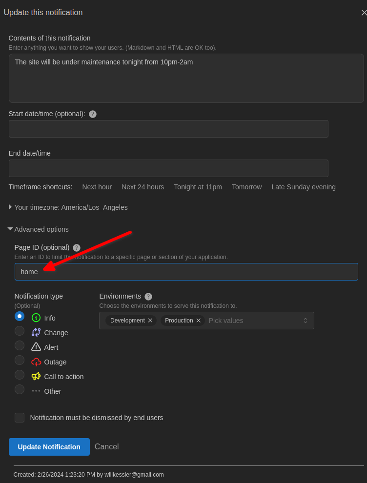

# Example React Application for _This is Not A Drill!_


This repo contains a sample application for the _This Is Not A Drill!_ service.

See the `.env_example` file for setup instructions. To get started,
copy the file `.env_example` to `.env`, and then enter your API key in
the file where indicated in the file.

Once you've entered an API key, you can try out your own notifications
inside this sample application's pages. In the dashboard, set the
`page` parameter on your notification to match the one used to
instantiate the TINAD component in the sample application page.

For example, if you take a look at `src/components/HomePage.tsx`
you'll see the component rendered with this JSX fragment:

``` javascript
<TinadComponent pageId="home" mode="toast" template={CustomTemplate} />
```

The `pageId` parameter will only render notifications identified by a
page value of `home` in the dashboard.  The `template` parameter can
be used to pass a custom template for inlined notifications (not modal
or toast types).



When you render the TinadComponent without a `pageId` parameter, then
all applicable notifications will be served on every page where the
component renders.

More documentation is available at https://www.this-is-not-a-drill.com.
